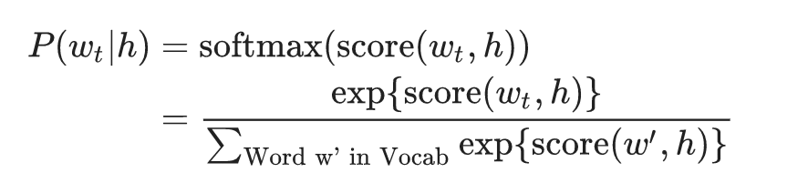
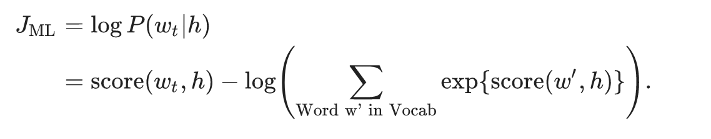
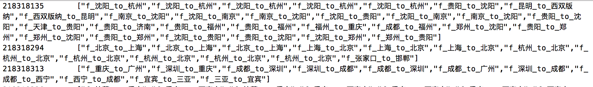
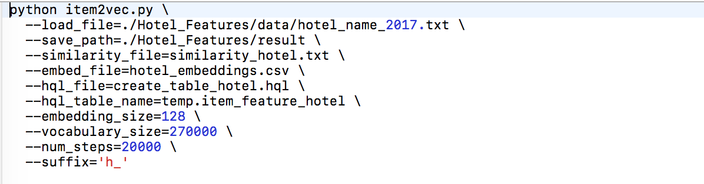

# Item2Vec 代码实现

## 算法简介

#### Item2Vec主要用到的是Skip-Gram模型,通过maximum likelihood原则去最大化给定context后target的概率，这里使用了softmax函数去实现。



#### 在得到概率后，可以用log-likelihood去得到信息熵，因此模型可以转变成最大化信息熵的最优问题。




#### 但是，如果按照一般的分类问题的话，这个类别的量级会非常大(商品的数量)。因此，这里采用了negative sampling的方法，通俗来说，就是把负样本进行抽样，例如：32个负样本，我们就转化成了一个32+1=33个类别的常规分类问题。

#### 注意：如果想直接使用ItemVector特征,可以直接到最后一部分的模型结果。


## 获取数据


#### 获取用户的完整下单顺序，商品的名称可以自定义。例如：机票可以用出发点和到达点来表达: f-上海-深圳。参考[代码](code_flght.sql)。
#### 下图是user_id对应的机票下单情况。



## 上传数据至GPU云
#### 将获取的数据，例如：flight-path-2017.txt，上传至GPU服务器。注:如果本地机器性能好，可在本地训练。


 
## 训练模型

#### 代码[item2vec.py](item2vec.py)封装了模型的类，我们只需要按实际情况修改参数并运行[run_code.sh](run_code.sh)即可。

### 1.出参。该函数会返回以下三个文件：
#### 1.1.create_table.hql,例如:create_table_flight.hql. 这个文件是用于生成ItemVector对应的hive表.
#### 1.2.embeddings.csv,例如:flight_embeddings.csv. 这个就是ItemVector的文件，可以将这个文件插入Hive表中。
#### 1.3.similarity.txt,例如:similarity_flight.txt. 这个是测试部分item的相似度，用于直观地验证模型的效果。


### 2.入参。
#### 2.1 load_file. 获取的序列数据.
#### 2.2 save_path. 输出的结果文件目录.
#### 2.3 similarity_file. 相似度测试文件的文件名.
#### 2.4 embed_file. ItemVector文件的文件名.
#### 2.5 hql_file. HQL文件的文件名.
#### 2.6 hql_table_name. HQL文件中的想要定义的临时表的表名.
#### 2.7 embedding_size. ItemVector的维度数量.
#### 2.8 vocabulary_size. Item的数量.如果其大于真实入参文件的数量会自动跳出程序.
#### 2.9 num_steps. 模型训练的步数.
#### 2.10 suffix. HQL文件中输出的结果的字段的前缀.





## <a name ="模型结果"></a>模型结果
##### 模型的结果尽量上传到Hive中，便于后续的特征关联，下面是三个业务线的ItemVector。注：这三个业务线覆盖了99%拿去花用户的订单业务。
```
##1.机票
temp.item_feature_flight
##2.火车票
temp.item_feature_train
##3.酒店
temp.item_feature_hotel
```


